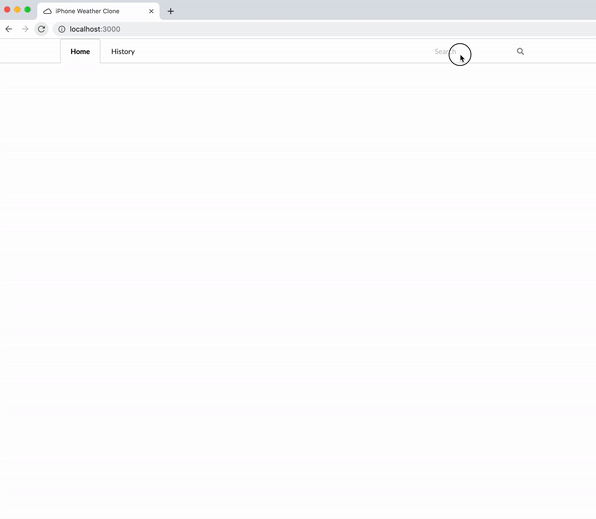

## An iPhone Weather App clone. Built with React and the Dark Sky API

### DEMO



### How it works:

1. User input fires off a call to the [MapBox API](https://www.mapbox.com/) and retrieves coordinates and the place name:

```
    axios
    .get(mapBoxUrl)
    .then(async geocodeData => {
      const long = geocodeData.data.features[0].center[0]
      const lat = geocodeData.data.features[0].center[1]
      const place = geocodeData.data.features[0].place_name
```

2. Then, the coordinates are sent to the [Dark Sky API](https://darksky.net) to retrieve weather data:

```
      await axios
        .get(`${proxy}${darkSkiesUrl}${lat},${long}?exclude=flags`)
        .then(request => {
          const weatherData = request.data
          dispatch(displayedPlace(place))
          dispatch(fetchWeatherSuccess(weatherData))
        })
        .catch(error =>
          console.log('Error making darksky call: ', error)
        )
    })
    .catch(error => console.log('Error making geocode call: ', error))
```

### Technologies used

`react` `react-redux` `react-router-dom` `create-react-app` `react-skycons` `semantic-ui-react` `react-media` `redux-thunk` `uuid` `momentjs` `axios`

### Editing/Setup

1. Clone the repo 
  `git clone https://github.com/stevendelro/startnow-react200-movie-finder`
2. Install the dependencies 
  `yarn install`
3. Run build 
  `yarn start`

### License

MIT
